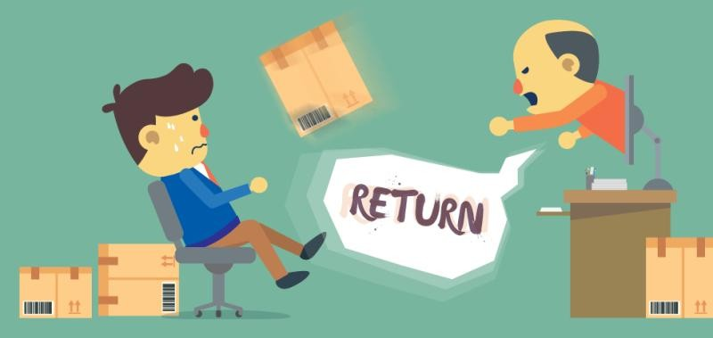

<!--StartFragment-->

Professors don't always get holidays, but even we can appreciate the joyous frenzy of a record-breaking holiday shopping season! ️ However, as January settles in, a different tide begins to roll in: the wave of product returns. In 2024, with sales reaching sky-high peaks, this tidal wave promises to be a tsunami!

Returns result in increased supply chain costs and pressures on supply chain

While most customers see returns as simply sending an item back, the reality is that returns trigger a complex domino effect in the supply chain. Let's discuss some of the hidden impacts of returning products:

1. **Reverse Logistics:** Unlike the streamlined flow of outbound products, returns travel a backroad riddled with challenges. Sorting, inspecting, and restocking returned items require additional labor, space, and technology. This can strain resources and disrupt normal operations, leading to delays and inefficiencies.

2. **Environmental Fallout:** The return journey often comes at the cost of increased carbon emissions. Each returned item generates transportation-related greenhouse gases, adding to the environmental footprint of the product. Sustainable packaging that can withstand multiple journeys can help mitigate this impact. ♻️

3. **Inventory Headaches:** The returned goods, depending on their condition, may not always find their way back to the shelves. This can create stock discrepancies and inaccurate inventory levels, making it difficult to meet future demand. Accurate product descriptions and clear return policies can help reduce unnecessary returns and maintain inventory clarity.

4. **Financial Footprints:** Remember, every return represents lost revenue and additional processing costs. These can eat into profits and impact businesses, especially smaller ones. Offering flexible exchange options or store credit can encourage customers to keep the items while still providing them with satisfaction. ️✨

### Takeaways for Customers and Supply Chain Managers

So, **what can customers do** to be part of the solution?

* Shop mindfully: Consider the need and long-term use before hitting "buy." ️
* Read reviews and research: Invest time in understanding the product to avoid impulse returns.
* Utilize virtual try-on and sizing tools: When available, these can help ensure the perfect fit and reduce unnecessary returns.
* Choose sustainable packaging: Opt for brands that prioritize recyclable or reusable materials. ♻️

For **supply chain managers**, the message is clear:

* Invest in reverse logistics infrastructure: Streamline the return process to minimize resource drain and delays.
* Embrace data analytics: Leverage data to understand return patterns and identify areas for improvement.
* Offer sustainable return options: Consider carbon-neutral shipping or local return hubs to reduce the environmental impact.
* Partner with your customers: Communicate return policies clearly and offer solutions like repair or exchange to build trust and reduce unnecessary returns.

### Conclusion

Remember, sustainable supply chains start with mindful actions from both businesses and consumers. Let's work together to navigate this January wave and build a more efficient, responsible, and greener future for product returns!

\#SupplyChainManagement #Sustainability #ProductReturns #Retail #CustomerExperience #CircularEconomy #GreenLogistics

### References:

\[1] <https://kpmg.com/xx/en/home/insights/2023/12/supply-chain-trends-2024.html>

\[2] <https://www.ingrammicrolifecycle.com/blog/how-returns-policies-influence-consumer-behavior>

\[3] <https://rethink.industries/article/to-address-product-returns-consider-sustainability-as-the-solution/>

\[4] <https://www.businessrecord.com/trend-of-online-sales-expected-to-pick-up-pace-in-2024-reshaping-business-model-and-need-for-space/>

\[5] <https://www.spglobal.com/en/research-insights/articles/daily-update-january-8-2024>

\[6] <https://theconversation.com/just-in-time-for-back-to-school-shopping-how-retailers-can-alter-customer-behavior-to-encourage-more-sustainable-returns-206164>

\[7] <https://www.mdpi.com/2071-1050/14/1/410>

\[8] <https://www.prnewswire.com/news-releases/bonchon-follows-record-breaking-year-for-new-store-sales-with-significant-market-expansion-in-2024-302038435.html>

\[9] <https://www.bloomberg.com/news/newsletters/2024-01-03/supply-chain-latest-volatile-year-ahead-for-global-trade>

\[10] <https://www.linkedin.com/pulse/customer-focus-how-return-policies-shape-behaviors-vikas-mittal>

\[11] <https://www.forbes.com/sites/forbestechcouncil/2022/04/22/the-environmental-cost-of-free-returns-how-to-ensure-returns-bolster-sustainability-and-the-cyclical-economy/>

\[12] <https://www2.deloitte.com/us/en/insights/industry/manufacturing/manufacturing-industry-outlook.html>

\[13] <https://blog.blueyonder.com/how-do-consumers-feel-about-retails-evolving-return-policies/>

\[14] <https://www.researchgate.net/publication/274460790_Managing_Product_Returns_to_Achieve_Supply_Chain_Sustainability_An_Exploratory_Study_and_Research_Propositions>

\[15] <https://www.whitehouse.gov/briefing-room/statements-releases/2023/11/27/fact-sheet-president-biden-announces-new-actions-to-strengthen-americas-supply-chains-lower-costs-for-families-and-secure-key-sectors/>

\[16] <https://www.termsfeed.com/blog/how-return-policy-affect-customer-retention/>

\[17] <https://hbr.org/2023/06/how-brands-can-sell-to-environmentally-conscious-nonconsumers>

\[18] <https://www.supplychaindive.com/news/retail-peak-returns-season-holiday-shopping/702972/>

\[19] <https://www.sciencedirect.com/science/article/abs/pii/S0148296318300705>

\[20] <https://www.mckinsey.com/capabilities/operations/our-insights/product-sustainability-back-to-the-drawing-board>

\[21] <https://zignify.net/five-supply-chain-and-logistics-trends-we-expect-in-2024/>

\[22] <https://www.emerald.com/insight/content/doi/10.1108/IJPDLM-10-2019-0302/full/html>

\[23] <https://www.pwc.com/gx/en/industries/industrial-manufacturing/publications/sustainability-in-manufacturing.html>

\[24] <https://news.utdallas.edu/business-management/researchers-examine-effect-of-return-policies-on-c/>

\[25] <https://publyon.com/sustainability-in-the-end-of-life-of-a-product/>

<!--EndFragment-->