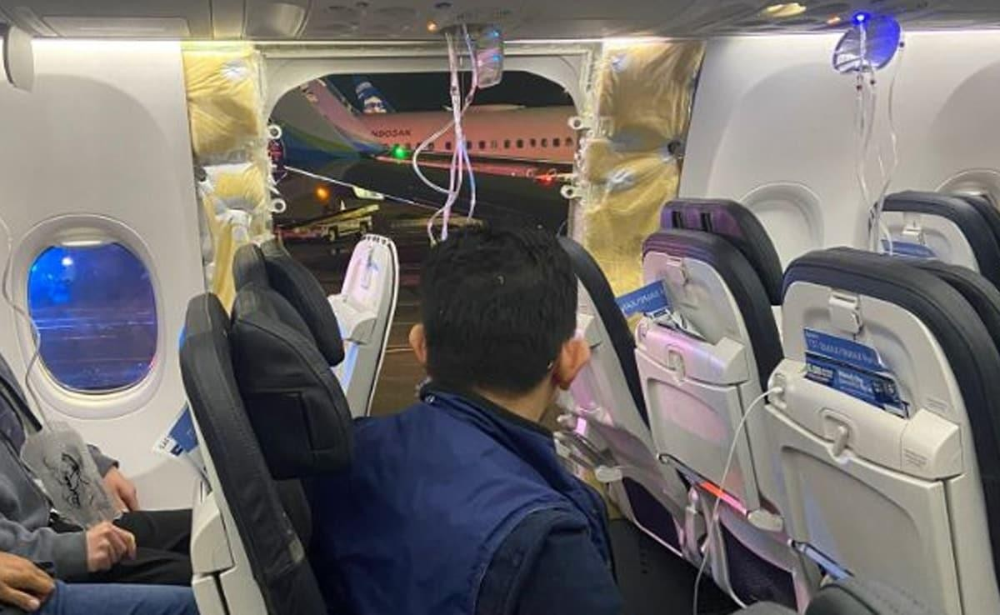

<!--StartFragment-->

[Boeing](https://www.linkedin.com/company/boeing/), one of the world's largest aerospace manufacturers, has been facing a series of quality control issues that have tarnished its reputation and damaged its relationships with its suppliers and customers. The most recent incident involved a door plug that blew off an [Alaska Airlines](https://www.linkedin.com/company/alaska-airlines/) 737 Max 9 plane during flight, forcing an emergency landing and the grounding of the entire fleet of 171 Max 9s globally. A [defective door plug](https://abcnews.go.com/US/timeline-incident-involving-missing-door-plug-boeing-737/story?id=106191494) on the plane forced an emergency landing on January 6, 2024. The cause of the incident was two-fold:

1. The investigation revealed that **the door stops became disengaged**, allowing the plug to blow out of the fuselage.
2. The **door plug was mis-installed by Boeing**, Boeing's records indicated that four bolts that prevent the door plug from moving up were not installed when the airplane was delivered.

Mid-cabin exit door was completely separated from the 737 Max 9 aircraft on January 6, 2024.

[FAA announced on January 24 that it has required Boeing to halt the production](https://www.faa.gov/newsroom/faa-halts-boeing-max-production-expansion-improve-quality-control-also-lays-out-extensive) of the 737 Max plane Also, there are reports of [ripple effects on the aerospace industry](https://www.reuters.com/business/aerospace-defense/faa-halt-boeing-max-production-expansion-hit-airlines-suppliers-2024-01-25/) due to the #production #qualityconcerns at Boeing.

In this article, I will explore some of the probable causes and consequences of Boeing's quality control problems and offer some recommendations for #supplychainmanagers who deal with Boeing or similar situations in their #supplychains.

### Root Causes of Quality Control Problems

* **A culture of profit over safety:** Boeing has been accused of prioritizing speed and cost over quality and safety, especially in the development and production of the 737 Max series, which was designed to compete with Airbus A320neo.
* **A lack of oversight and accountability:** Too much influence and control over the certification and inspection processes of its products and accusations of hiding the severity of the problems.
* **A complex and fragmented supply chain:** Boeing relies on hundreds of suppliers and designers from around the world creating challenges in quality assurance and risk management.

### Supply Chain Impacts of Boeing's Quality Control Problems

Boeing's problems will have serious and lasting impacts on its supply chain and customers, such as:

* **Loss of trust and reputation:** Erosion of the confidence and loyalty of its customers, who have suffered from delays, cancellations, and safety concerns.
* **Loss of market share and revenue:** Costs in billions of dollars in fines, settlements, compensation, and lost orders.
* **Loss of innovation and talent:** Struggle to attract and retain the best talent, as its culture and performance have been questioned and criticized.

### Lessons for Supply Chain Managers

**Focus on quality and safety**: Always put quality and safety first, and do not compromise them for short-term gains or pressures. Ensure that your *suppliers and partners share the same values and standards, and monitor and audit them*regularly.

**Strengthen oversight and accountability**: Establish clear and transparent processes and procedures for certification and inspection of products and involve credible third parties to verify them.

**Simplify and streamline**: Reduce the complexity and fragmentation of your supply chain and focus on the core competencies.

### Conclusion

Boeing's problems due to quality control are a lesson for supply chain managers who deal with similar situations. They show the importance of #quality and #safety, #oversight and #accountability, and #simplicity and #streamlining in the supply chain.

<!--EndFragment-->