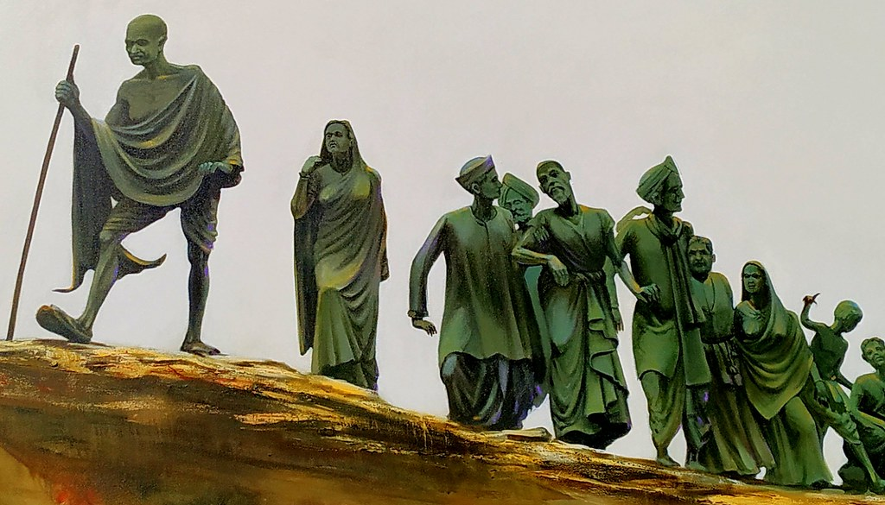

<!--StartFragment-->

As we reflect on India's journey to independence, let's dive into an often overlooked aspect that played a pivotal role in our struggle for independence - **Logistics and Supply Chain Management**. 🛢️💡

🌐 Imagine coordinating a nationwide movement across diverse terrains and cultures without the digital tools we rely on today. That's what our forefathers accomplished during India's fight for freedom. The Salt March of 1930, led by the great Mahatma Gandhi, wasn't just a symbolic protest against the salt tax; it was a logistics marvel. 🚶 ♂️✉️

💪 Let's break it down: Across 400 km, Gandhi and his followers marched, leveraging supply chain principles. Local resources were tapped for food and shelter, showcasing sustainability and minimizing the movement's environmental footprint. 🍽️🛏️

📢 Communication played a significant role. Despite limited technology, messages spread like wildfire, uniting millions. Much like today's data-driven decision-making, leaders back then had to rely on cleverly designed strategies to transmit information seamlessly. 📡📜

> 🚴 ♂️ Bicycle couriers ferried news, circulars, and orders, resembling our modern-day logistics carriers. Their efficiency ensured messages reached even the remotest corners, bolstering unity and strength. 🚲📦

💬 The **Quit India movement of 1942** stands as another remarkable testament. While it echoed the call for independence, it also highlighted the importance of a well-organized network. Supply routes, meeting points, and safe houses were meticulously planned, mirroring today's robust supply chain networks. 🏭🏠

🌍 The logistics prowess displayed during these movements demonstrated that an organized approach, strategic thinking, and effective resource management can indeed reshape the course of history. 📈

So, let's celebrate not just the courage of our freedom fighters, but also the logistical brilliance that threaded the tapestry of India's independence movement. As we excel in the modern business landscape, may we draw inspiration from their legacy and apply their principles to create a brighter future for the future generations. 🌅

<!--EndFragment-->