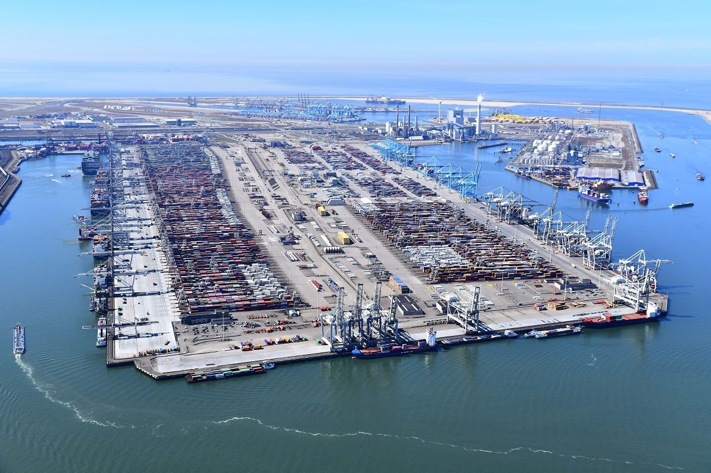

<!--StartFragment-->

## Introduction

The maritime industry is a complex ecosystem, and ports worldwide face multifaceted challenges in their relentless pursuit of operational excellence. From orchestrating intricate logistics to ensuring seamless vessel movements, the demands on port authorities are ever-increasing and multifarious. 🏭🌐 Amidst this intricate landscape, the [Port of Rotterdam](https://www.linkedin.com/company/port-of-rotterdam/) has emerged as a trailblazer, embracing cutting-edge technologies, particularly Artificial Intelligence (AI), to confront these hurdles head-on and catalyze transformative change. 💻🔍

## Challenges Confronting Ports

Ports are the vital arteries of global trade, but they often grapple with formidable obstacles:

1. Congestion and bottlenecks, leading to inefficiencies and delays that ripple through the supply chain 🚧

2. Environmental concerns and the pressing need to meet sustainability goals in an era of climate consciousness 🌳🌍

3. Safety and security risks, posing threats to operations, personnel, and cargo integrity 🔒

4. Coordination among a myriad of stakeholders, including shipping lines, logistics providers, and regulatory bodies 🤝

The Port of Rotterdam recognized these multifaceted challenges and sought innovative solutions to optimize its operations, maintain its competitive edge, and future-proof its operations. 💡

## AI: Unlocking Efficiency in Port Operations

AI has emerged as a powerful catalyst to revolutionize port operations, offering:

1. Predictive analytics for vessel traffic management and forecasting, enabling proactive decision-making 📈

2. Automated scheduling and resource allocation for optimized utilization and reduced waste 🗓️

3. Real-time monitoring and anomaly detection for proactive risk mitigation and rapid response 👀

4. Intelligent decision support systems for informed decision-making and strategic planning 🧠

By leveraging AI's power, ports can streamline processes, reduce costs, enhance overall efficiency, and drive sustainable growth, positioning themselves as agile and future-ready entities.

## Port of Rotterdam's AI-Driven Transformation

[Port of Rotterdam](https://www.linkedin.com/company/port-of-rotterdam/) has been at the forefront of AI adoption, implementing cutting-edge solutions such as:

1. Vessel Traffic Management System (VTMS) powered by AI for optimized vessel movements and reduced congestion 🛳️

2. Predictive maintenance for port infrastructure, enabling proactive maintenance and minimizing downtime 🔧

3. Automated container handling and logistics optimization for enhanced productivity and efficiency 📦

4. Intelligent energy management systems for sustainable operations and reduced environmental impact 🔋

These initiatives have yielded remarkable results, including reduced congestion, improved safety, increased sustainability, and enhanced competitiveness, solidifying Rotterdam's position as a global maritime leader.

## Insights for Port Managers and Stakeholders

To unlock the full potential of AI in port operations, managers and stakeholders should:

1. Cultivate a data-driven culture and invest in robust data infrastructure and governance 📊

2. Foster collaboration among stakeholders and promote knowledge sharing for seamless integration 🤝

3. Prioritize cybersecurity and data privacy measures to mitigate risks and ensure compliance 🔒

4. Upskill the workforce and promote AI literacy to facilitate adoption and maximize benefits 👩💻

By adopting these strategies, ports can unleash the transformative power of AI and stay ahead in the ever-evolving maritime landscape. 🌐⚓️

## Conclusion and Future Trends

The @Port of Rotterdam's success story serves as a beacon for the industry, showcasing the immense potential of AI in optimizing port operations and driving sustainable growth. As technology continues to advance, we can expect to witness:

1. Increased adoption of autonomous vessels and smart port infrastructure for enhanced efficiency and safety 🚢🤖

2. Integration of AI with Internet of Things (IoT) and edge computing for real-time data processing and decision-making 📶

3. Collaborative AI platforms for seamless stakeholder coordination and information sharing 🤝💻

4. Sustainable and eco-friendly port operations driven by AI-powered solutions for environmental stewardship 🌳🌍

The future of ports lies in embracing innovation and unleashing the power of AI to navigate the tides of change and remain competitive in the global maritime landscape. 🌊⚓️💡

\#PortOperations #ArtificialIntelligence #SupplyChainOptimization #Rotterdam #Maritime #Logistics

References:

Heilig, L., & Voß, S. (2017). Information systems in seaports: a categorization and overview. Information Technology and Management, 18(3), 179-201.

Petering, M. E. (2015). Decision support for yard truck routing at seaport container terminals. Transportation Research Part C: Emerging Technologies, 51, 172-187.

Port of Rotterdam. (2021). Artificial Intelligence in the Port of Rotterdam. Retrieved from <https://www.portofrotterdam.com/en/doing-business/port-of-the-future/innovation/artificial-intelligence>

<!--EndFragment-->