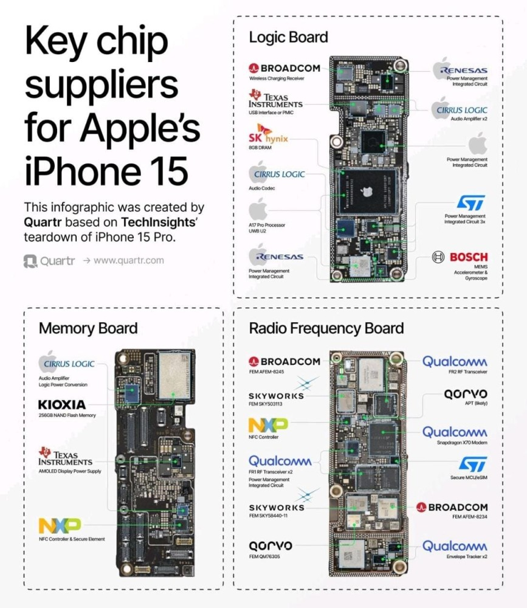

<!--StartFragment-->

I came across a fascinating infographic detailing the chip suppliers for [Apple](https://www.linkedin.com/company/apple/)'s iPhone 15.

Apple utilizes a variety of suppliers to source chips for iPhone 15.

As a supply chain management expert, this sparked some intriguing thoughts on supplier diversification and risk mitigation strategies in high-tech industries. Let's look the details! 🏊♂️

## Introduction

Apple, like many tech giants, faces significant challenges in managing its complex supply chain:

• Global chip shortages 🌐

• Geopolitical tensions affecting trade 🌍

• Rapid technological advancements 🚀

• Sustainability pressures 🌱

These factors create a perfect storm of supply chain complexity, requiring innovative approaches to ensure resilience and continuity.

How Supplier Diversification Helps Apple:

Apple's strategy, as evident from the iPhone 15 chip supplier list, showcases effective supplier diversification:

1. **Geographic Spread:** Suppliers from multiple countries (US, South Korea, Japan) 🗺️

2. **Capability Variety:** Mix of specialized (e.g., Skyworks for RF) and multi-capable suppliers (e.g., Qualcomm) 🔧

3. **Size Balance:** Blend of tech giants (Broadcom, Qualcomm) and smaller specialists (Qorvo, Cirrus Logic) ⚖️

### This approach helps Apple:

• Mitigate regional supply disruptions

• Access best-in-class technologies

• Maintain negotiating power

• Reduce dependency on single sources

## Insights for Supply Chain Managers

1. Map your supply network thoroughly, including tier 2 and 3 suppliers 🗺️

2. Develop multi-sourcing strategies for critical components 🔄

3. Invest in supplier relationship management across diverse partner types 🤝

4. Stay agile and ready to pivot sourcing strategies as geopolitical landscapes shift 🏃♀️

5. Balance cost efficiencies with resilience in supplier selection 💰🛡️

## Future Trends in Diversification

1. **Nearshoring:** Expect increased focus on regional supply clusters to reduce logistics risks 🏭

2. **Onshoring:** Critical components may see domestic production boosts, especially in semiconductors 🏗️

3. **AI-driven supply chain** mapping and risk assessment 🤖

4. Increased emphasis on **supplier sustainability** credentials 🌿

5. Blockchain for enhanced **supply chain transparency** and traceability 🔗

## Conclusion

Apple's approach to chip supplier diversification for the iPhone 15 offers valuable lessons for all industries grappling with supply chain complexities. By strategically spreading risk and fostering a diverse supplier ecosystem, companies can build resilience against disruptions while driving innovation.

As we observe an increasingly uncertain global landscape, the ability to maintain a flexible, diversified supply chain will be a key differentiator for successful businesses. 📚💡

**\#SupplyChainManagement #SupplierDiversification #TechIndustry #RiskMitigation #Innovation**

Chip Suppliers for iPhone 15 (as per infographic):

Logic Board: Broadcom, Texas Instruments, SK hynix, Cirrus Logic, Apple, Renesas, ST Microelectronics, Bosch

Memory Board: Cirrus Logic, Kioxia, Texas Instruments, NXP

Radio Frequency Board: Broadcom, Skyworks, NXP, Qualcomm, Qorvo, ST Microelectronics

What do you think about supplier diversification strategies? How is your industry adapting to supply chain challenges? Let's discuss this in the comments! 👇💬

<!--EndFragment-->