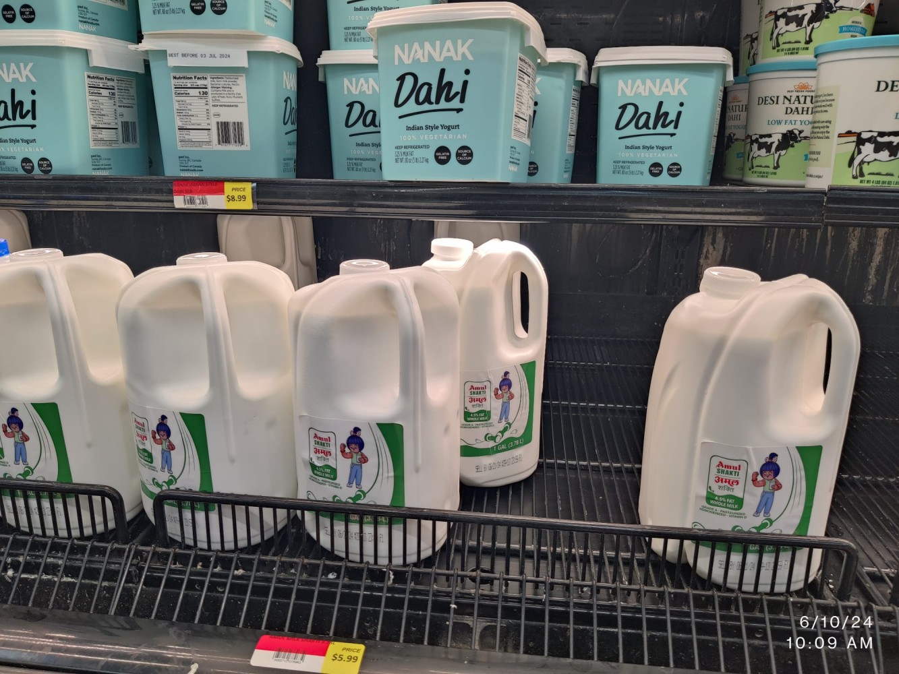

<!--StartFragment-->

Recently, I stumbled upon [Amul (GCMMF)](https://www.linkedin.com/company/gcmmf/) milk at my local Patel grocery store in Atlanta! 🙌 Seeing this iconic Indian brand on the shelves was an exciting moment. To provide some context, Amul, the renowned dairy cooperative from Gujarat, recently launched its milk products in the US market, partnering with the Michigan Milk Producers Association.

**\#SupplyChainInsights #ConsumerBehavior #SocialMediaAnalytics #BrandStrategy**

This strategic partnership allowed Amul to overcome potential supply chain disruptions by sourcing milk locally while maintaining its signature taste and quality standards. By collaborating with Michigan dairy farmers, Amul reduced the risks of importing milk from India over long distances.

However, the launch has sparked interesting discussions among the Indian diaspora (NRIs) in the US. I came across several comments on social media platforms ([Instagram](https://www.instagram.com/reel/C7rSaACMtSx/), [Facebook](https://www.facebook.com/groups/630370187740345/search/?q=amul), etc.) that highlighted varying consumer perceptions:

> "And how is this different from other milks that you find here? This milk is being produced in India and shipped here? Or we are just jumping on the Indian brand Bandwagon?" 🤔
>
> "For all the commenters saying it's imported or won't taste like home. It's been made here in collab with Michigan Milk Producers Association & formula is from Gujarat Cooperative aka Amul. They did lots of testing and figured out how to make it just like Amul in India." 💡
>
> "Unless it comes from Desi cow it's not real Amul milk!" 🐄
>
> "Amul is just brand .. Milk is still American milk it is not exported from India …" 🧐

These comments highlight NRI consumers' diverse perspectives and expectations regarding Amul's US launch. Some are skeptical about the authenticity and taste, while others appreciate the brand's efforts to replicate the Indian experience.

### Consumer Behavior Insights for Amul 🧠

From a marketing perspective, these comments underscore the importance of understanding consumer behavior and addressing potential concerns proactively. Amul should leverage social media analytics to monitor and analyze real-time consumer sentiments, preferences, and perceptions.

By incorporating consumer behavior theories, such as the Theory of Planned Behavior and the Elaboration Likelihood Model, Amul can tailor its branding and marketing strategies to resonate with NRI consumers effectively. For instance, emphasizing the brand's heritage, quality assurance processes, and collaborative efforts with local dairy farmers could help alleviate concerns and build trust among skeptical consumers.

### Lessons for Amul and Other Indian Brands 📚

Amul's US launch is a valuable case study for other Indian brands seeking to expand into the NRI market. Key lessons include:

1. **Supply Chain Resilience**: Partnering with local suppliers or manufacturers can mitigate supply chain risks and ensure consistent product availability.

2. **Consumer Insights**: Leveraging social media analytics and consumer behavior theories can provide valuable insights into target audience preferences and concerns, enabling data-driven marketing strategies.

3. **Authenticity and Localization**: Striking a balance between preserving brand authenticity and adapting to local tastes and preferences is crucial for resonating with NRI consumers.

4. **Transparent Communication**: Proactive and transparent communication about sourcing, production processes, and quality assurance measures can build trust and address consumer skepticism.

### Conclusion 🎯

Amul's US launch highlights the complexities of introducing iconic Indian brands to the NRI market. By embracing consumer behavior insights, leveraging social media analytics, and fostering supply chain resilience, Amul and other Indian brands can navigate consumer perceptions effectively and establish a strong foothold in the US market.

**\#ConsumerInsights #BrandAuthenticity #SupplyChainResilience #NRIMarketing**

### References:

\- Ajzen, I. (1991). The theory of planned behavior. Organizational Behavior and Human Decision Processes, 50(2), 179-211.

\- Petty, R. E., & Cacioppo, J. T. (1986). The elaboration likelihood model of persuasion. In Communication and persuasion (pp. 1-24). Springer, New York, NY.

Citations:

\[1] <https://assets.openstax.org/oscms-prodcms/media/documents/Principles_Marketing-WEB.pdf>

\[2] <https://www.cognizant.com/en_us/insights/documents/from-to-everything-you-wanted-to-know-about-the-future-of-your-work-but-were-afraid-to-ask-codex4799.pdf>

\[3] [https://journal.oscm-forum.org/journal/journal/download/20210109155656_Paper_9_Vol._14\_No\_._2,\_2021\_.pdf](https://journal.oscm-forum.org/journal/journal/download/20210109155656_Paper_9_Vol._14_No_._2,_2021_.pdf)

\[4] <https://www.tableau.com/community/community-leaders/ambassadors>

\[5] <https://www.linkedin.com/posts/deniceviktoriastaaf_supplychain-logistics-leadership-activity-7204442581705904128-dzLA>

<!--EndFragment-->